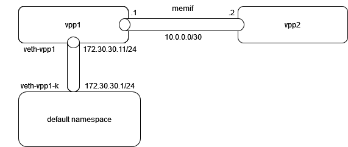
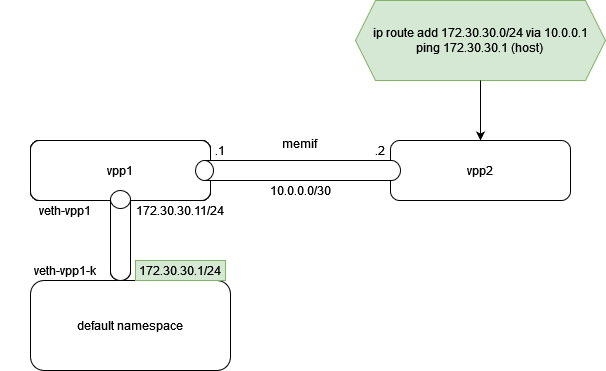

# vpp-testing

This project gathers playing around with VPP.

## Setup


## Installation
Steps on fd.io did not work (dependencies).
The script https://packagecloud.io/fdio/release/install provides a straightforward installation.

```
sudo -i
curl -s https://packagecloud.io/install/repositories/fdio/release/script.deb.sh | sudo bash
```

After a few minutes, apt sources and keys are installed.
```
apt install vpp vpp-plugin-core vpp-plugin-dpdk
```
That should be sufficient to start. I am having a few errors in the service, but this is running.

```console
root@ubuntu-vpp2:~# systemctl status vpp
● vpp.service - vector packet processing engine
     Loaded: loaded (/lib/systemd/system/vpp.service; enabled; vendor preset: enabled)
     Active: active (running) since Mon 2021-09-20 09:25:04 PDT; 14s ago
    Process: 3574 ExecStartPre=/sbin/modprobe uio_pci_generic (code=exited, status=1/FAILURE)
   Main PID: 3580 (vpp_main)
      Tasks: 2 (limit: 9513)
     Memory: 65.4M
     CGroup: /system.slice/vpp.service
             └─3580 /usr/bin/vpp -c /etc/vpp/startup.conf
Sep 20 09:25:04 ubuntu-vpp2 systemd[1]: Starting vector packet processing engine...
Sep 20 09:25:04 ubuntu-vpp2 modprobe[3574]: modprobe: FATAL: Module uio_pci_generic not found in directory /lib/modules/5.4.0-84-generic
Sep 20 09:25:04 ubuntu-vpp2 systemd[1]: Started vector packet processing engine.
Sep 20 09:25:04 ubuntu-vpp2 vpp[3580]: unix_config:476: couldn't open log '/var/log/vpp/vpp.log'
Sep 20 09:25:05 ubuntu-vpp2 vpp[3580]: /usr/bin/vpp[3580]: perfmon: skipping source 'intel-uncore' - intel_uncore_init: no uncore units found
Sep 20 09:25:05 ubuntu-vpp2 /usr/bin/vpp[3580]: perfmon: skipping source 'intel-uncore' - intel_uncore_init: no uncore units found
Sep 20 09:25:05 ubuntu-vpp2 vpp[3580]: /usr/bin/vpp[3580]: pci: Skipping PCI device 0000:00:04.0 as host interface ens4 is up
Sep 20 09:25:05 ubuntu-vpp2 /usr/bin/vpp[3580]: pci: Skipping PCI device 0000:00:04.0 as host interface ens4 is up
Sep 20 09:25:05 ubuntu-vpp2 vnet[3580]: dpdk/cryptodev: dpdk_cryptodev_init: Failed to configure cryptodev
Sep 20 09:25:05 ubuntu-vpp2 vnet[3580]: vat-plug/load: vat_plugin_register: oddbuf plugin not loaded...
root@ubuntu-vpp2:~# 
```

Note that the config file is located here

```console
root@ubuntu-vpp2:~# cat /etc/vpp/startup.conf

unix {
  nodaemon
  log /var/log/vpp/vpp.log
  full-coredump
  cli-listen /run/vpp/cli.sock
  gid vpp
  [...]
```

##

### Reach the CLI

You can get the CLI socket from the startup.conf file above. Default works, but if you create several vpp instance, you might want to tell which socket you pluf the CLI client to.

``` 
#### default 
sudo vppctl
#### if you have several vpp instance tell which socket you want to reach
sudo vppctl -s /run/vpp/cli.sock
```

```console
root@ubuntu-vpp2:~# vppctl
    _______    _        _   _____  ___ 
 __/ __/ _ \  (_)__    | | / / _ \/ _ \
 _/ _// // / / / _ \   | |/ / ___/ ___/
 /_/ /____(_)_/\___/   |___/_/  /_/    

vpp# 
```
And we can try a few basic commands
```
vpp# show version 
vpp v21.06-release built by root on 0bbaef8ef60b at 2021-06-30T14:33:58
vpp# sho interface 
              Name               Idx    State  MTU (L3/IP4/IP6/MPLS)     Counter          Count     
local0                            0     down          0/0/0/0       
vpp# 
```
There is a comprehensive contextual help
```console

vpp# show ?
  show abf attach                          show abf attach <interface>
  show abf policy                          show abf policy <value>
  show acl-plugin acl                      show acl-plugin acl [index N]
  show acl-plugin decode 5tuple            show acl-plugin decode 5tuple XXXX XXXX XXXX XXXX XXXX XXXX
  show acl-plugin interface                show acl-plugin interface [sw_if_index 
vpp# sho api ?
  show api clients                         Client information
  show api dump                            show api dump file <filename> [numeric | compare-current]
  show api histogram                       show api histogram
  show api message-table                   Message Table
  show api plugin                          show api plugin
  show api ring-stats                      Message ring statistics
  show api trace-status                    Display API trace status
vpp# sho api clients
vpp# 
```

### Getting started with networking

Create a veth pair in kernel to plug vpp on it.


Configure the interfaces (requires root)
```
sudo -i
ip link add veth-vpp1-k type veth peer name veth-vpp1
ip link set up dev veth-vpp1-k
ip link set up dev veth-vpp1
ip addr add 172.30.30.1/24 dev veth-vpp1-k
```
Check interfaces
```console
root@ubuntu-vpp2:~# ip addr
1: lo: <LOOPBACK,UP,LOWER_UP> mtu 65536 qdisc noqueue state UNKNOWN group default qlen 1000
    link/loopback 00:00:00:00:00:00 brd 00:00:00:00:00:00
    inet 127.0.0.1/8 scope host lo
       valid_lft forever preferred_lft forever
    inet6 ::1/128 scope host 
       valid_lft forever preferred_lft forever
2: ens4: <BROADCAST,MULTICAST,UP,LOWER_UP> mtu 1500 qdisc fq_codel state UP group default qlen 1000
    link/ether 52:54:00:cc:98:2e brd ff:ff:ff:ff:ff:ff
    inet 10.57.89.54/24 brd 10.57.89.255 scope global ens4
       valid_lft forever preferred_lft forever
    inet6 fe80::5054:ff:fecc:982e/64 scope link 
       valid_lft forever preferred_lft forever
3: veth-vpp1@veth-vpp1-k: <BROADCAST,MULTICAST,UP,LOWER_UP> mtu 1500 qdisc noqueue state UP group default qlen 1000
    link/ether 56:21:98:6b:a3:2a brd ff:ff:ff:ff:ff:ff
    inet6 fe80::5421:98ff:fe6b:a32a/64 scope link 
       valid_lft forever preferred_lft forever
4: veth-vpp1-k@veth-vpp1: <BROADCAST,MULTICAST,UP,LOWER_UP> mtu 1500 qdisc noqueue state UP group default qlen 1000
    link/ether ea:47:f5:92:c3:5f brd ff:ff:ff:ff:ff:ff
    inet 172.30.30.1/24 scope global veth-vpp1-k
       valid_lft forever preferred_lft forever
    inet6 fe80::e847:f5ff:fe92:c35f/64 scope link 
       valid_lft forever preferred_lft forever
root@ubuntu-vpp2:~# 
```
Now, via vpp cli:
- bind the veth-vpp1 to the VPP process
- add ip configuration.
```
create host-interface name veth-vpp1
set interface ip address host-veth-vpp1 172.30.30.11/24
```
Outputs
```console

root@ubuntu-vpp2:~# vppctl
    _______    _        _   _____  ___ 
 __/ __/ _ \  (_)__    | | / / _ \/ _ \
 _/ _// // / / / _ \   | |/ / ___/ ___/
 /_/ /____(_)_/\___/   |___/_/  /_/    

vpp# sho interface 
              Name               Idx    State  MTU (L3/IP4/IP6/MPLS)     Counter          Count     
local0                            0     down          0/0/0/0       
vpp# create host-interface ?
  create host-interface                    create host-interface name <ifname> [hw-addr <mac-addr>]
vpp# create host-interface name veth-vpp1
host-veth-vpp1
vpp# sho inter                           
              Name               Idx    State  MTU (L3/IP4/IP6/MPLS)     Counter          Count     
host-veth-vpp1                    1     down         9000/0/0/0     
local0                            0     down          0/0/0/0       
vpp# 

vpp# sho hardware-interfaces 
              Name                Idx   Link  Hardware
host-veth-vpp1                     1     up   host-veth-vpp1
  Link speed: unknown
  RX Queues:
    queue thread         mode      
    0     main (0)       interrupt 
  Ethernet address 02:fe:68:6a:3f:82
  Linux PACKET socket interface
  block:10485760 frame:10240
  next frame:0
  available:1024 request:0 sending:0 wrong:0 total:1024

local0                             0    down  local0
  Link speed: unknown
  local
vpp# set interface state host-veth-vpp1 up              
vpp# sho interface 
              Name               Idx    State  MTU (L3/IP4/IP6/MPLS)     Counter          Count     
host-veth-vpp1                    1      up          9000/0/0/0     
local0                            0     down          0/0/0/0       
vpp# 
vpp#   set interface ip address host-veth-vpp1 172.30.30.11/24
vpp#
```
Check ip forwarding states. 

```
vpp# sho ip fib
ipv4-VRF:0, fib_index:0, flow hash:[src dst sport dport proto flowlabel ] epoch:0 flags:none locks:[adjacency:1, default-route:1, ]
0.0.0.0/0
  unicast-ip4-chain
  [@0]: dpo-load-balance: [proto:ip4 index:1 buckets:1 uRPF:0 to:[0:0]]
    [0] [@0]: dpo-drop ip4
0.0.0.0/32
  unicast-ip4-chain
  [@0]: dpo-load-balance: [proto:ip4 index:2 buckets:1 uRPF:1 to:[0:0]]
    [0] [@0]: dpo-drop ip4
172.30.30.0/32
  unicast-ip4-chain
  [@0]: dpo-load-balance: [proto:ip4 index:10 buckets:1 uRPF:9 to:[0:0]]
    [0] [@0]: dpo-drop ip4
172.30.30.1/32
  unicast-ip4-chain
  [@0]: dpo-load-balance: [proto:ip4 index:13 buckets:1 uRPF:12 to:[0:0] via:[3:252]]
    [0] [@5]: ipv4 via 172.30.30.1 host-veth-vpp1: mtu:9000 next:3 flags:[] ea47f592c35f02fe686a3f820800
172.30.30.0/24
  unicast-ip4-chain
  [@0]: dpo-load-balance: [proto:ip4 index:9 buckets:1 uRPF:8 to:[0:0]]
    [0] [@4]: ipv4-glean: [src:172.30.30.0/24] host-veth-vpp1: mtu:9000 next:1 flags:[] ffffffffffff02fe686a3f820806
172.30.30.11/32
  unicast-ip4-chain
  [@0]: dpo-load-balance: [proto:ip4 index:12 buckets:1 uRPF:13 to:[3:252]]
    [0] [@2]: dpo-receive: 172.30.30.11 on host-veth-vpp1
172.30.30.255/32
  unicast-ip4-chain
  [@0]: dpo-load-balance: [proto:ip4 index:11 buckets:1 uRPF:11 to:[0:0]]
    [0] [@0]: dpo-drop ip4
224.0.0.0/4
  unicast-ip4-chain
  [@0]: dpo-load-balance: [proto:ip4 index:4 buckets:1 uRPF:3 to:[0:0]]
    [0] [@0]: dpo-drop ip4
240.0.0.0/4
  unicast-ip4-chain
  [@0]: dpo-load-balance: [proto:ip4 index:3 buckets:1 uRPF:2 to:[0:0]]
    [0] [@0]: dpo-drop ip4
255.255.255.255/32
  unicast-ip4-chain
  [@0]: dpo-load-balance: [proto:ip4 index:5 buckets:1 uRPF:4 to:[0:0]]
    [0] [@0]: dpo-drop ip4
vpp#
```

And run pings from host to the VPP process
```
ubuntu@ubuntu-vpp2:~$ ping 172.30.30.11
PING 172.30.30.11 (172.30.30.11) 56(84) bytes of data.
64 bytes from 172.30.30.11: icmp_seq=1 ttl=64 time=0.417 ms
64 bytes from 172.30.30.11: icmp_seq=2 ttl=64 time=0.182 ms
^C
--- 172.30.30.11 ping statistics ---
2 packets transmitted, 2 received, 0% packet loss, time 1012ms
rtt min/avg/max/mdev = 0.182/0.299/0.417/0.117 ms
ubuntu@ubuntu-vpp2:~$ 
```

### memif interface to second VPP process

Shared memory packet interface (memif) provides high performance packet transmit and receive between user application and VPP. We create another VPP process (vpp2) which will interface with our first vpp process (vpp1).

Networking will be configured as per below diagram:



Launch a second VPP instance
```
sudo -i
cat << EOF > startup-vpp2.conf 
unix {
  nodaemon
  log /var/log/vpp/vpp2.log
  full-coredump
  cli-listen /run/vpp/cli-vpp2.sock
  gid vpp
}
EOF
vpp -c startup-vpp2.conf &
```
To connect to the second vpp instance
```
vppctl -s /run/vpp/cli-vpp2.sock 
```

In the first vpp instance (vpp1),

```
create interface memif id 0 master
set interface ip address memif0/0 10.0.0.1/24
set interface state memif0/0 up
```

```
vpp# sho interface 
              Name               Idx    State  MTU (L3/IP4/IP6/MPLS)     Counter          Count     
host-veth-vpp1                    1      up          9000/0/0/0     rx packets                   100
                                                                    rx bytes                    7084
                                                                    tx packets                     7
                                                                    tx bytes                     574
                                                                    drops                         93
                                                                    ip4                            5
                                                                    ip6                           93
local0                            0     down          0/0/0/0       
memif0/0                          2      up          9000/0/0/0     
vpp# sho interface address
host-veth-vpp1 (up):
  L3 172.30.30.11/24
local0 (dn):
memif0/0 (up):
  L3 10.0.0.1/24
vpp# 
```

Similarly in the second instance (memif is in slave mode)

```
create interface memif id 0 slave
set interface ip address memif0/0 10.0.0.2/24
set interface state memif0/0 up
```

After that, pings just work fine...

``` 
### pings from vpp2
vpp# ping 10.0.0.1
116 bytes from 10.0.0.1: icmp_seq=2 ttl=64 time=15.9945 ms
116 bytes from 10.0.0.1: icmp_seq=3 ttl=64 time=16.1362 ms

```

Let's create another with different one and inspect what we see. There are a lot of options to create the memif interface  tx/rx queues and bugger size can be configured directly.
```
##### VPP1 instance

vpp# create interface memif ?  
  create interface memif                   create interface memif [id <id>] [socket-id <socket-id>] [ring-size <size>] [buffer-size <size>] [hw-addr <mac-address>] <master|slave> [rx-queues <number>] [tx-queues <number>] [mode ip] [secret <string>]
vpp# create interface memif id 2  master           
vpp# sho interface      
[...]
memif0/2                          3     down         9000/0/0/0     
vpp# 
interface memif0/0
  remote-name "VPP 21.06-release"
  remote-interface "memif0/0"
  socket-id 0 id 0 mode ethernet
  flags admin-up connected
  listener-fd 21 conn-fd 22
  num-s2m-rings 1 num-m2s-rings 1 buffer-size 0 num-regions 2
  region 0 size 33024 fd 23
  region 1 size 41943040 fd 24
    master-to-slave ring 0:
      region 0 offset 16512 ring-size 1024 int-fd 26
      head 1024 tail 3 flags 0x0001 interrupts 0
    slave-to-master ring 0:
      region 0 offset 0 ring-size 1024 int-fd 25
      head 3 tail 3 flags 0x0001 interrupts 0
interface memif0/2
  socket-id 0 id 2 mode ethernet
  flags admin-up
  listener-fd 21 conn-fd 0
  num-s2m-rings 0 num-m2s-rings 0 buffer-size 0 num-regions 0
vpp#

##### fd 21 used to plug the memif socket - checked in lsof - 
root@ubuntu-vpp2:~# lsof /run/vpp/memif.sock 
COMMAND   PID USER   FD   TYPE             DEVICE SIZE/OFF  NODE NAME
vpp_main 3580 root   21u  unix 0xffff91a770c9d800      0t0 96925 /run/vpp/memif.sock type=SEQPACKET
vpp_main 3580 root   22u  unix 0xffff91a6accab000      0t0 96996 /run/vpp/memif.sock type=SEQPACKET


##### Create the sibbling memif interface on vpp2 instance.

vpp#  create interface memif id 2  slave                 
vpp# sho memif 
sockets
  id  listener    filename
  0   no          /run/vpp/memif.sock

interface memif0/0
  remote-name "VPP 21.06-release"
  remote-interface "memif0/0"
  socket-id 0 id 0 mode ethernet
  flags admin-up slave connected zero-copy
  listener-fd 0 conn-fd 19
  num-s2m-rings 1 num-m2s-rings 1 buffer-size 2048 num-regions 2
  region 0 size 33024 fd 20
  region 1 size 41943040 fd 4
    slave-to-master ring 0:
      region 0 offset 0 ring-size 1024 int-fd 21
      head 3 tail 3 flags 0x0001 interrupts 0
    master-to-slave ring 0:
      region 0 offset 16512 ring-size 1024 int-fd 22
      head 1024 tail 3 flags 0x0001 interrupts 0
interface memif0/2
  socket-id 0 id 2 mode ethernet
  flags slave zero-copy
  listener-fd 0 conn-fd 0
  num-s2m-rings 0 num-m2s-rings 0 buffer-size 0 num-regions 0
[...]
memif0/2                          2     down         9000/0/0/0     

#### Only after admin state set to up at vpp2, the memif interfaces are in correct states.

vpp# set interface state memif0/2 up 
vpp# show  memif 
sockets
  id  listener    filename
  0   no          /run/vpp/memif.sock

interface memif0/0
  remote-name "VPP 21.06-release"
  remote-interface "memif0/0"
  socket-id 0 id 0 mode ethernet
  flags admin-up slave connected zero-copy
  listener-fd 0 conn-fd 19
  num-s2m-rings 1 num-m2s-rings 1 buffer-size 2048 num-regions 2
  region 0 size 33024 fd 20
  region 1 size 41943040 fd 4
    slave-to-master ring 0:
      region 0 offset 0 ring-size 1024 int-fd 21
      head 3 tail 3 flags 0x0001 interrupts 0
    master-to-slave ring 0:
      region 0 offset 16512 ring-size 1024 int-fd 22
      head 1024 tail 3 flags 0x0001 interrupts 0
interface memif0/2
  remote-name "VPP 21.06-release"
  remote-interface "memif0/2"
  socket-id 0 id 2 mode ethernet
  flags admin-up slave connected zero-copy
  listener-fd 0 conn-fd 23
  num-s2m-rings 1 num-m2s-rings 1 buffer-size 2048 num-regions 2
  region 0 size 33024 fd 24
  region 1 size 41943040 fd 4
    slave-to-master ring 0:
      region 0 offset 0 ring-size 1024 int-fd 25
      head 0 tail 0 flags 0x0001 interrupts 0
    master-to-slave ring 0:
      region 0 offset 16512 ring-size 1024 int-fd 26
      head 1024 tail 0 flags 0x0001 interrupts 0
vpp# 

##### vpp1 output

vpp# sho memif 
sockets
  id  listener    filename
  0   yes (2)     /run/vpp/memif.sock

interface memif0/0
  remote-name "VPP 21.06-release"
  remote-interface "memif0/0"
  socket-id 0 id 0 mode ethernet
  flags admin-up connected
  listener-fd 21 conn-fd 22
  num-s2m-rings 1 num-m2s-rings 1 buffer-size 0 num-regions 2
  region 0 size 33024 fd 23
  region 1 size 41943040 fd 24
    master-to-slave ring 0:
      region 0 offset 16512 ring-size 1024 int-fd 26
      head 1024 tail 3 flags 0x0001 interrupts 0
    slave-to-master ring 0:
      region 0 offset 0 ring-size 1024 int-fd 25
      head 3 tail 3 flags 0x0001 interrupts 0
interface memif0/2
  remote-name "VPP 21.06-release"
  remote-interface "memif0/2"
  socket-id 0 id 2 mode ethernet
  flags admin-up connected
  listener-fd 21 conn-fd 27
  num-s2m-rings 1 num-m2s-rings 1 buffer-size 0 num-regions 2
  region 0 size 33024 fd 28
  region 1 size 41943040 fd 29
    master-to-slave ring 0:
      region 0 offset 16512 ring-size 1024 int-fd 31
      head 1024 tail 0 flags 0x0001 interrupts 0
    slave-to-master ring 0:
      region 0 offset 0 ring-size 1024 int-fd 30
      head 0 tail 0 flags 0x0001 interrupts 0


A new fd  is visible on the host (same socket)

root@ubuntu-vpp2:~# lsof /run/vpp/memif.sock 
COMMAND   PID USER   FD   TYPE             DEVICE SIZE/OFF  NODE NAME
vpp_main 3580 root   21u  unix 0xffff91a770c9d800      0t0 96925 /run/vpp/memif.sock type=SEQPACKET
vpp_main 3580 root   22u  unix 0xffff91a6accab000      0t0 96996 /run/vpp/memif.sock type=SEQPACKET
vpp_main 3580 root   27u  unix 0xffff91a6acca8800      0t0 97033 /run/vpp/memif.sock type=SEQPACKET
root@ubuntu-vpp2:~# 

##### vpp2 process open sockets 

root@ubuntu-vpp2:~# lsof -p 22390
[...]
vpp_main 22390 root   19u     unix 0xffff91a6acca8400      0t0  96995 type=SEQPACKET
vpp_main 22390 root   20u      REG                0,1    33024  96997 /memfd:memif0/0 region 0 (deleted)
vpp_main 22390 root   21u  a_inode               0,14        0  10385 [eventfd]
vpp_main 22390 root   22u  a_inode               0,14        0  10385 [eventfd]
vpp_main 22390 root   23u     unix 0xffff91a6accaa000      0t0  97032 type=SEQPACKET
[...]
vpp_main 22390 root   24u      REG                0,1    33024  97034 /memfd:memif0/2 region 0 (deleted)
vpp_main 22390 root   25u  a_inode               0,14        0  10385 [eventfd]
vpp_main 22390 root   26u  a_inode               0,14        0  10385 [eventfd]
```


*After that vpp the second VPP process crashed !!! So I am resarting with a new vpp2/memif interface - and won't create two interfaces this time (maybe it is better to have distinct sockets via "create memif socket" ? - not really important for now*

### Traces

Tracing packets with VPP - for memif interface use "memif-input" instead.

```
vpp# trace add af-packet-input 3 
vpp#   ping 172.30.30.1         
116 bytes from 172.30.30.1: icmp_seq=1 ttl=64 time=.4558 ms
116 bytes from 172.30.30.1: icmp_seq=2 ttl=64 time=8.0909 ms

ubuntu@ubuntu-vpp2:~$ 
vpp# show trace
------------------- Start of thread 0 vpp_main -------------------
Packet 1

22:50:50:550268: af-packet-input
  af_packet: hw_if_index 1 next-index 4
    tpacket2_hdr:
      status 0x20000001 len 110 snaplen 110 mac 66 net 80
      sec 0x6151e02b nsec 0x275a0189 vlan 0 vlan_tpid 0
22:50:50:550284: ethernet-input
  IP4: ea:47:f5:92:c3:5f -> 02:fe:68:6a:3f:82
22:50:50:550306: ip4-input
  ICMP: 172.30.30.1 -> 172.30.30.11
    tos 0x00, ttl 64, length 96, checksum 0x6172 dscp CS0 ecn NON_ECN
    fragment id 0x84e2
  ICMP echo_reply checksum 0x1642 id 62101
22:50:50:550314: ip4-lookup
  fib 0 dpo-idx 7 flow hash: 0x00000000
  ICMP: 172.30.30.1 -> 172.30.30.11
    tos 0x00, ttl 64, length 96, checksum 0x6172 dscp CS0 ecn NON_ECN
    fragment id 0x84e2
  ICMP echo_reply checksum 0x1642 id 62101
22:50:50:550335: ip4-local
    ICMP: 172.30.30.1 -> 172.30.30.11
      tos 0x00, ttl 64, length 96, checksum 0x6172 dscp CS0 ecn NON_ECN
      fragment id 0x84e2
    ICMP echo_reply checksum 0x1642 id 62101
22:50:50:550337: ip4-icmp-input
  ICMP: 172.30.30.1 -> 172.30.30.11
    tos 0x00, ttl 64, length 96, checksum 0x6172 dscp CS0 ecn NON_ECN
    fragment id 0x84e2
  ICMP echo_reply checksum 0x1642 id 62101
22:50:50:550342: ip4-icmp-echo-reply
  ICMP4 echo id 62101 seq 1 send to cli node 698
```

### IP routing

Add ip routing in VPP2 to ping the veth IP leaving kernel (172.30.30.1.).



```
ip route add  172.30.30.0/24 via 10.0.0.1
```

But that does not work immediately.

```console
vpp# ip route add  172.30.30.0/24 via 10.0.0.1

vpp# show ip fib
ipv4-VRF:0, fib_index:0, flow hash:[src dst sport dport proto flowlabel ] epoch:0 flags:none locks:[adjacency:1, recursive-resolution:1, default-route:1, ]
0.0.0.0/0
  unicast-ip4-chain
  [@0]: dpo-load-balance: [proto:ip4 index:1 buckets:1 uRPF:0 to:[0:0]]
    [0] [@0]: dpo-drop ip4
0.0.0.0/32
  unicast-ip4-chain
  [@0]: dpo-load-balance: [proto:ip4 index:2 buckets:1 uRPF:1 to:[0:0]]
    [0] [@0]: dpo-drop ip4
10.0.0.0/32
  unicast-ip4-chain
  [@0]: dpo-load-balance: [proto:ip4 index:10 buckets:1 uRPF:11 to:[0:0]]
    [0] [@0]: dpo-drop ip4
10.0.0.1/32
  unicast-ip4-chain
  [@0]: dpo-load-balance: [proto:ip4 index:13 buckets:1 uRPF:10 to:[5:480] via:[6:576]]
    [0] [@5]: ipv4 via 10.0.0.1 memif0/0: mtu:9000 next:3 flags:[] 02fe35bd5e4302fee13ff4c90800
10.0.0.0/24
  unicast-ip4-chain
  [@0]: dpo-load-balance: [proto:ip4 index:9 buckets:1 uRPF:14 to:[1:96]]
    [0] [@4]: ipv4-glean: [src:10.0.0.0/24] memif0/0: mtu:9000 next:1 flags:[] ffffffffffff02fee13ff4c90806
10.0.0.2/32
  unicast-ip4-chain
  [@0]: dpo-load-balance: [proto:ip4 index:12 buckets:1 uRPF:15 to:[6:576]]
    [0] [@2]: dpo-receive: 10.0.0.2 on memif0/0
10.0.0.255/32
  unicast-ip4-chain
  [@0]: dpo-load-balance: [proto:ip4 index:11 buckets:1 uRPF:13 to:[0:0]]
    [0] [@0]: dpo-drop ip4
172.30.30.0/24
  unicast-ip4-chain
  [@0]: dpo-load-balance: [proto:ip4 index:14 buckets:1 uRPF:16 to:[5:480]]
    [0] [@12]: dpo-load-balance: [proto:ip4 index:13 buckets:1 uRPF:10 to:[5:480] via:[6:576]]

vpp# ping  172.30.30.1

Statistics: 5 sent, 0 received, 100% packet loss
vpp#
```

So we use traces

```

```


### MPLS forwarding


### 


## Links

https://fd.io/docs/vpp/v2101/gettingstarted/progressivevpp/index.html

