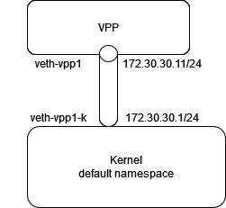

# vpp-testing

This project gathers playing around with VPP.

## Setup


## Installation
Steps on fd.io did not work (dependencies).
The script https://packagecloud.io/fdio/release/install provides a straightforward installation.

```
sudo -i
curl -s https://packagecloud.io/install/repositories/fdio/release/script.deb.sh | sudo bash
```

After a few minutes, apt sources and keys are installed.
```
apt install vpp vpp-plugin-core vpp-plugin-dpdk
```
That should be sufficient to start. I am having a few errors in the service, but this is running.

```console
root@ubuntu-vpp2:~# systemctl status vpp
● vpp.service - vector packet processing engine
     Loaded: loaded (/lib/systemd/system/vpp.service; enabled; vendor preset: enabled)
     Active: active (running) since Mon 2021-09-20 09:25:04 PDT; 14s ago
    Process: 3574 ExecStartPre=/sbin/modprobe uio_pci_generic (code=exited, status=1/FAILURE)
   Main PID: 3580 (vpp_main)
      Tasks: 2 (limit: 9513)
     Memory: 65.4M
     CGroup: /system.slice/vpp.service
             └─3580 /usr/bin/vpp -c /etc/vpp/startup.conf
Sep 20 09:25:04 ubuntu-vpp2 systemd[1]: Starting vector packet processing engine...
Sep 20 09:25:04 ubuntu-vpp2 modprobe[3574]: modprobe: FATAL: Module uio_pci_generic not found in directory /lib/modules/5.4.0-84-generic
Sep 20 09:25:04 ubuntu-vpp2 systemd[1]: Started vector packet processing engine.
Sep 20 09:25:04 ubuntu-vpp2 vpp[3580]: unix_config:476: couldn't open log '/var/log/vpp/vpp.log'
Sep 20 09:25:05 ubuntu-vpp2 vpp[3580]: /usr/bin/vpp[3580]: perfmon: skipping source 'intel-uncore' - intel_uncore_init: no uncore units found
Sep 20 09:25:05 ubuntu-vpp2 /usr/bin/vpp[3580]: perfmon: skipping source 'intel-uncore' - intel_uncore_init: no uncore units found
Sep 20 09:25:05 ubuntu-vpp2 vpp[3580]: /usr/bin/vpp[3580]: pci: Skipping PCI device 0000:00:04.0 as host interface ens4 is up
Sep 20 09:25:05 ubuntu-vpp2 /usr/bin/vpp[3580]: pci: Skipping PCI device 0000:00:04.0 as host interface ens4 is up
Sep 20 09:25:05 ubuntu-vpp2 vnet[3580]: dpdk/cryptodev: dpdk_cryptodev_init: Failed to configure cryptodev
Sep 20 09:25:05 ubuntu-vpp2 vnet[3580]: vat-plug/load: vat_plugin_register: oddbuf plugin not loaded...
root@ubuntu-vpp2:~# 
```

Note that the config file is located here

```console
root@ubuntu-vpp2:~# cat /etc/vpp/startup.conf

unix {
  nodaemon
  log /var/log/vpp/vpp.log
  full-coredump
  cli-listen /run/vpp/cli.sock
  gid vpp
  [...]
```

##

### Reach the CLI

You can get the CLI socket from the startup.conf file above. Default works, but if you create several vpp instance, you might want to tell which socket you pluf the CLI client to.

``` 
#### default 
sudo vppctl
#### if you have several vpp instance tell which socket you want to reach
sudo vppctl -s /run/vpp/cli.sock
```

```console
root@ubuntu-vpp2:~# vppctl
    _______    _        _   _____  ___ 
 __/ __/ _ \  (_)__    | | / / _ \/ _ \
 _/ _// // / / / _ \   | |/ / ___/ ___/
 /_/ /____(_)_/\___/   |___/_/  /_/    

vpp# 
```
And we can try a few basic commands
```
vpp# show version 
vpp v21.06-release built by root on 0bbaef8ef60b at 2021-06-30T14:33:58
vpp# sho interface 
              Name               Idx    State  MTU (L3/IP4/IP6/MPLS)     Counter          Count     
local0                            0     down          0/0/0/0       
vpp# 
```
There is a comprehensive contextual help
```console

vpp# show ?
  show abf attach                          show abf attach <interface>
  show abf policy                          show abf policy <value>
  show acl-plugin acl                      show acl-plugin acl [index N]
  show acl-plugin decode 5tuple            show acl-plugin decode 5tuple XXXX XXXX XXXX XXXX XXXX XXXX
  show acl-plugin interface                show acl-plugin interface [sw_if_index 
vpp# sho api ?
  show api clients                         Client information
  show api dump                            show api dump file <filename> [numeric | compare-current]
  show api histogram                       show api histogram
  show api message-table                   Message Table
  show api plugin                          show api plugin
  show api ring-stats                      Message ring statistics
  show api trace-status                    Display API trace status
vpp# sho api clients
vpp# 
```

### Getting started with networking

Create a veth pair in kernel to plug vpp on it.



Configure the interfaces (requires root)
```
sudo -i
ip link add veth-vpp1-k type veth peer name veth-vpp1
ip link set up dev veth-vpp1-k
ip link set up dev veth-vpp1
ip addr add 172.30.30.1/24 dev veth-vpp1-k
```
Check interfaces
```console
root@ubuntu-vpp2:~# ip addr
1: lo: <LOOPBACK,UP,LOWER_UP> mtu 65536 qdisc noqueue state UNKNOWN group default qlen 1000
    link/loopback 00:00:00:00:00:00 brd 00:00:00:00:00:00
    inet 127.0.0.1/8 scope host lo
       valid_lft forever preferred_lft forever
    inet6 ::1/128 scope host 
       valid_lft forever preferred_lft forever
2: ens4: <BROADCAST,MULTICAST,UP,LOWER_UP> mtu 1500 qdisc fq_codel state UP group default qlen 1000
    link/ether 52:54:00:cc:98:2e brd ff:ff:ff:ff:ff:ff
    inet 10.57.89.54/24 brd 10.57.89.255 scope global ens4
       valid_lft forever preferred_lft forever
    inet6 fe80::5054:ff:fecc:982e/64 scope link 
       valid_lft forever preferred_lft forever
3: veth-vpp1@veth-vpp1-k: <BROADCAST,MULTICAST,UP,LOWER_UP> mtu 1500 qdisc noqueue state UP group default qlen 1000
    link/ether 56:21:98:6b:a3:2a brd ff:ff:ff:ff:ff:ff
    inet6 fe80::5421:98ff:fe6b:a32a/64 scope link 
       valid_lft forever preferred_lft forever
4: veth-vpp1-k@veth-vpp1: <BROADCAST,MULTICAST,UP,LOWER_UP> mtu 1500 qdisc noqueue state UP group default qlen 1000
    link/ether ea:47:f5:92:c3:5f brd ff:ff:ff:ff:ff:ff
    inet 172.30.30.1/24 scope global veth-vpp1-k
       valid_lft forever preferred_lft forever
    inet6 fe80::e847:f5ff:fe92:c35f/64 scope link 
       valid_lft forever preferred_lft forever
root@ubuntu-vpp2:~# 
```
Now, via vpp cli:
- bind the veth-vpp1 to the VPP process
- add ip configuration.
```
create host-interface name veth-vpp1
set interface ip address host-veth-vpp1 172.30.30.11/24
```
Outputs
```console

root@ubuntu-vpp2:~# vppctl
    _______    _        _   _____  ___ 
 __/ __/ _ \  (_)__    | | / / _ \/ _ \
 _/ _// // / / / _ \   | |/ / ___/ ___/
 /_/ /____(_)_/\___/   |___/_/  /_/    

vpp# sho interface 
              Name               Idx    State  MTU (L3/IP4/IP6/MPLS)     Counter          Count     
local0                            0     down          0/0/0/0       
vpp# create host-interface ?
  create host-interface                    create host-interface name <ifname> [hw-addr <mac-addr>]
vpp# create host-interface name veth-vpp1
host-veth-vpp1
vpp# sho inter                           
              Name               Idx    State  MTU (L3/IP4/IP6/MPLS)     Counter          Count     
host-veth-vpp1                    1     down         9000/0/0/0     
local0                            0     down          0/0/0/0       
vpp# 

vpp# sho hardware-interfaces 
              Name                Idx   Link  Hardware
host-veth-vpp1                     1     up   host-veth-vpp1
  Link speed: unknown
  RX Queues:
    queue thread         mode      
    0     main (0)       interrupt 
  Ethernet address 02:fe:68:6a:3f:82
  Linux PACKET socket interface
  block:10485760 frame:10240
  next frame:0
  available:1024 request:0 sending:0 wrong:0 total:1024

local0                             0    down  local0
  Link speed: unknown
  local
vpp# set interface state host-veth-vpp1 up              
vpp# sho interface 
              Name               Idx    State  MTU (L3/IP4/IP6/MPLS)     Counter          Count     
host-veth-vpp1                    1      up          9000/0/0/0     
local0                            0     down          0/0/0/0       
vpp# 
vpp#   set interface ip address host-veth-vpp1 172.30.30.11/24
vpp#
```


